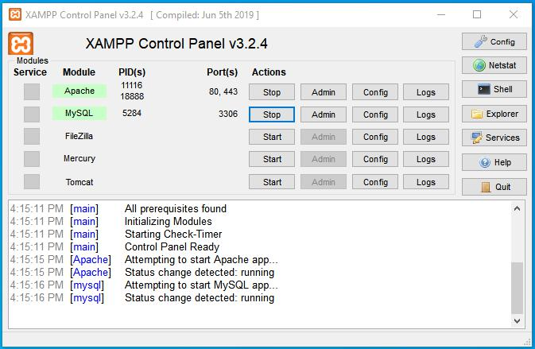

# Trajectory Analysis - Microsimulation (TrajAIM)

TrajAIM is a web-based application that enables the visualization and analysis of vehicle trajectories produced by the microscopic traffic simulator [Aimsun](https://www.aimsun.com/aimsun-next/).

# Installation Guide

To get TrajAIM running you need to install [XAMPP](https://www.apachefriends.org/index.html) and setup Apache and MySQL.

Moreover, you need to setup the databases [trajaim.sql](https://github.com/vmintsis/trajectory-analysis-microsimulation/blob/main/trajaim.sql) and [veh_traj.sql](https://github.com/vmintsis/trajectory-analysis-microsimulation/blob/main/veh_traj.sql) via [phpMyAdmin](https://www.phpmyadmin.net/).

TrajAIM can be accessed at the the following web address <http://127.0.0.1/trajaim/> via any web browser.

# Documentation

TrajAIM can process and visualize vehicle trajectories and other dynamic characteristics that are output as .fzp files from [Aimsun](https://www.aimsun.com/aimsun-next/).

Moroever, it enables the comparison of the latter characteristics that have been produced from different Aimsun Experiments.

Upon opening TrajAIM the user encouters two separate tabs (<strong>Tables</strong> and <strong>Analysis</strong>) that offer different functionalities.

## Tables Tab

Via the <strong>Tables</strong> tab the user can browse and upload the output files that contain information about vehicle dynamic characteristics.

In order to upload an output file the <strong>Initialize</strong> button should be clicked. 

In case of comparison of trajectories from different simulation experiments the user should check the <strong>Advise</strong> option and click the <strong>Merge</strong> button to upload the second output file.

The following figure depicts the <strong>Tables</strong> Tab and the functionalities that it provides:

**_NOTE:_** The .fzp files that have been produced by [Aimsun](https://www.aimsun.com/aimsun-next/) must be converted to .txt files prior to uploading to TrajAIM.

## Analysis Tab

Via the <strong>Analysis</strong> tab the user can specify the vehicles (types and ids) for which plots will be created.

The following types of plots can be generated by TrajAIM according to vehicle dynamic characteristics (i.e. location, speed, acceleration):

- distance vs time
- speed vs time
- speed vs distance
- acceleration vs time
- acceleration vs distance
- acceleration vs speed

The following figure depicts the <strong>Analysis</strong> Tab and the functionalities that it provides:

**_NOTE:_** By checking the option <strong>Export</strong> the data used for generating the selected plots are also exported in csv format in the correspodning [csv](https://github.com/vmintsis/trajectory-analysis-microsimulation/tree/main/csv) project folder.

# Technical questions

If you have a bug, please report it.

# Getting involved

We welcome your contributions.

- Please report bugs and improvements by submitting [GitHub issue](https://github.com/vmintsis/trajectory-analysis-microsimulation/issues).
- Submit your contributions using [pull requests](https://github.com/vmintsis/trajectory-analysis-microsimulation/pulls).

# Citing EVPA

If you use TrajAIM for academic research, you are highly encouraged to cite our paper:

E. Mintsis, E.I. Vlahogianni, E. Mitsakis, S. Ozkul, (2021). Enhanced speed advice for connected vehicles in the proximity of signalized intersections. European Transport Research Review 13(2). [Online]. Available: https://doi.org/10.1186/s12544-020-00458-y